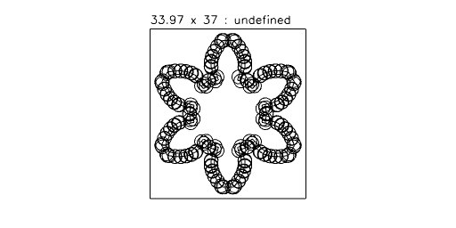

Cutting a gear profile without overcut.

Note that the concave corners are not cut completely, but the shape is not cut into.

---

Cutting a gear profile with overcut.

Note that the concave corners are cut completely, but the shape is cut into.
