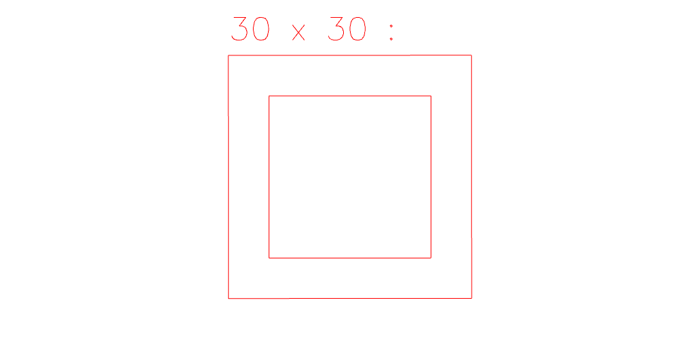

# Shape.add examples.

[Open in Editor](https://jsxcad.js.org/preAlphaHead/#JSxCAD@https://gitcdn.link/cdn/jsxcad/JSxCAD/master/api/v1-shape/add/add.nb)

---

Shape.add extends a shape to cover the other shapes.

---

For example, we can add the shape of a blue Circle to a red Square.
Note that the result is red, since the red square was extended to cover the area of the blue circle.

---

We can also add the shape of a Prism to a Square.
This adds the area of the prism in the plane of the square to the square.
