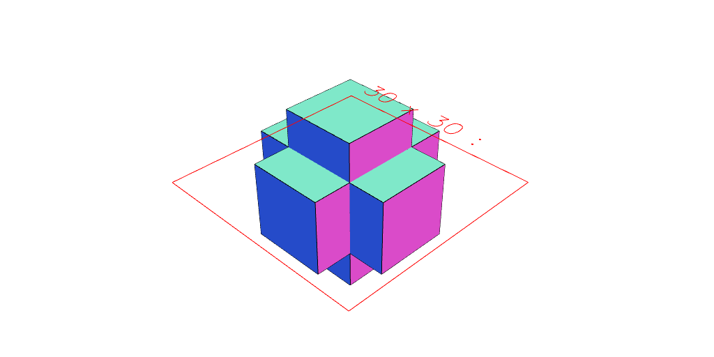
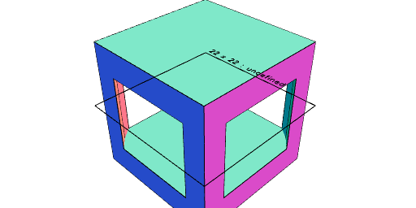
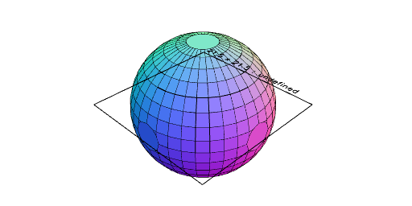
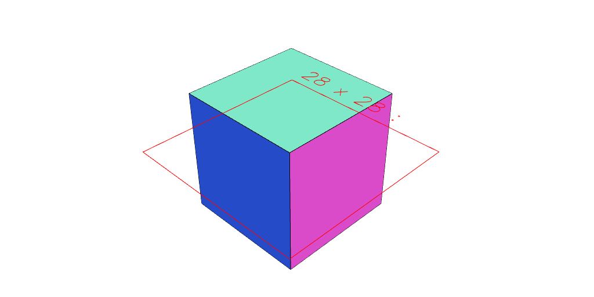

Some examples of constructive solid geometry.

'''
Box(10, 10, 20)
.add(Box(20, 10, 10))
.add(Box(10, 20, 10))
.view();
'''

---

'''
Box(20)
.cut(Rod(12, 12))
.view();
'''

---

'''
const orb = Sphere(10).clip(Cube(19.5));
'''

'''
Box(18, 18, 18)
.cut(orb)
.view();
'''
