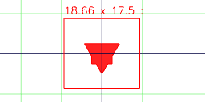
Triangle(10).color('red').add(Box(5).color('blue'))
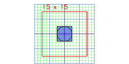
Box(5).and(Arc(5))
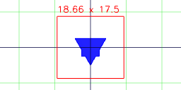
Triangle(10).color('red').addTo(Box(5).color('blue'))
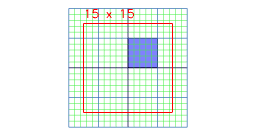
Box(5).align('x>y>')
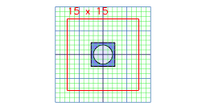
Box(5).as('box').with(Arc(4).as('arc')).keep('box')
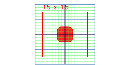
Box(5).color('red').clip(Arc(5.8).color('blue'))
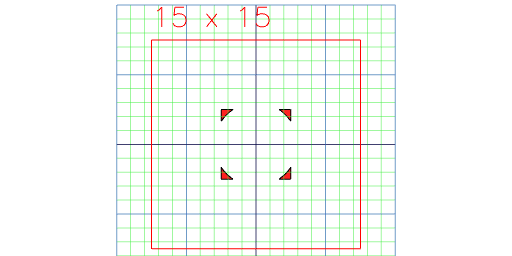
Box(5).color('red').clipFrom(Arc(5.8).color('blue'))

Box(5).color('orange')
Colors are green
Box(5).color('green').colors((s, colors) => { md`Colors are ${colors}`; return s; })

Box(5).color('red').cut(Arc(6).color('blue'))
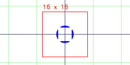
Box(5).color('red').cutFrom(Arc(6).color('blue'))
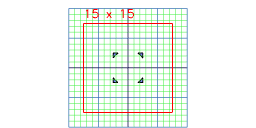
Assembly(Box(5), Arc(6)).each((leafs) => leafs[0])
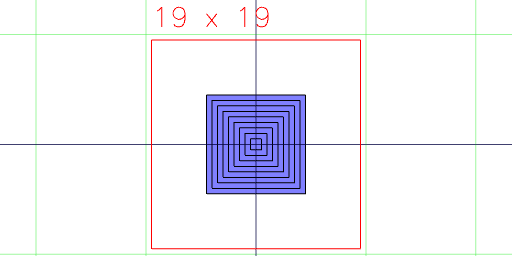
Group(Box(5).color('red'), Arc(6).color('blue')).fuse()
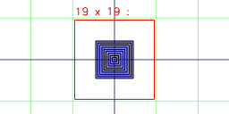
Box(10).inset(0.5, 0.5)
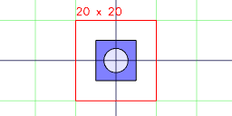
Assembly(Box(10).as('a'), Arc(6).as('b')).keep('a')
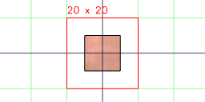
Box(10).material('copper')
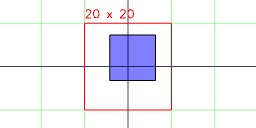
Box(10).move(1, 2, 3)
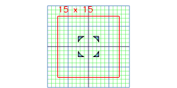
Assembly(Box(5), Arc(4).void()).noVoid()
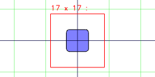
Box(5).offset(1)
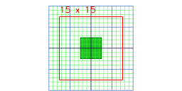
Box(5).op(s => s.color('green'))
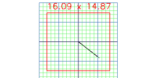
Line(10).orient({ at: [40, 50]})
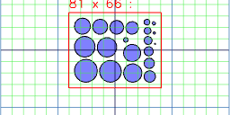
Group(...each((n) => Arc(n), { from: 1, to: 20 })).pack()
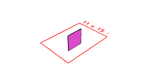
x.peg(Box(5))
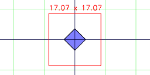
Box(5).rotate(45)
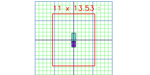
Box(1, 2, 3).rotateX(45)
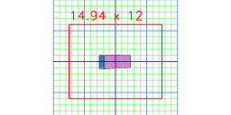
Box(1, 2, 3).rotateY(45)
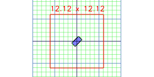
Box(1, 2, 3).rotateZ(45)
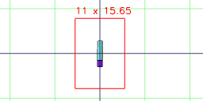
Box(1, 2, 3).rx(45)
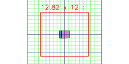
Box(1, 2, 3).ry(45)
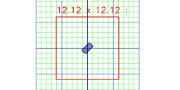
Box(1, 2, 3).rz(45)
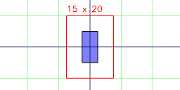
Box(5).scale(1, 2)
{"length":1.000000000000001,"width":2.000000000000002,"height":3.0000000000000018,"max":[0.5000000000000006,1.000000000000001,1.5000000000000009],"min":[-0.5000000000000006,-1.000000000000001,-1.5000000000000009],"center":[0,0,0],"radius":1.8708286933869722}
Box(1, 2, 3).size((size, shape) => { md`${JSON.stringify(size)}`; return shape; })
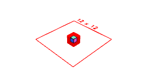
Box(2, 2, 2).and(Box(1, 1, 1).sketch())
box
Box(1).as('box').tags((tags, shape) => { md`${tags}`; return shape; })

Box(1).test()

Box(5).tool('laser')
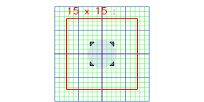
Assembly(Box(5), Arc(6).void())
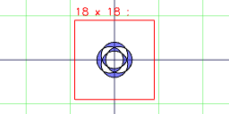
Weld(Arc(6).x(-1), Arc(6).x(1), Arc(6).y(1), Arc(6).y(-1)).fill()
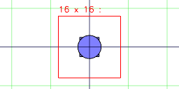
Box(5).with(Arc(6))
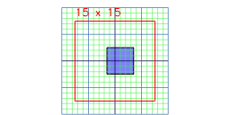
Box(5).x(1)
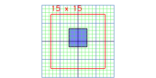
Box(5).y(1)
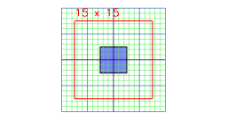
Box(5).z(1)