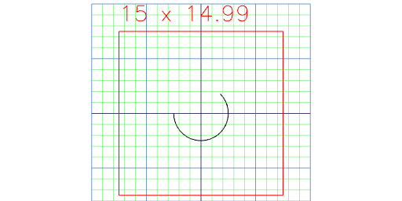
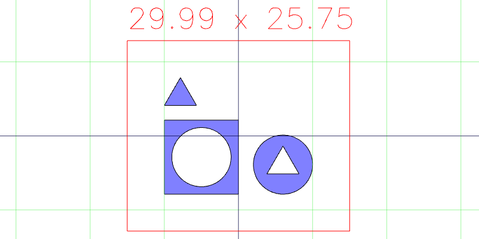
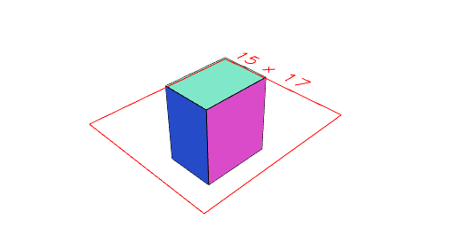
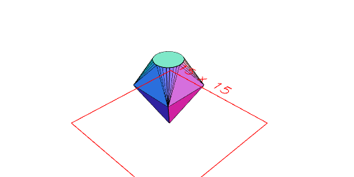
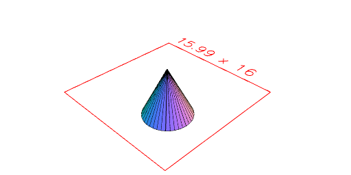
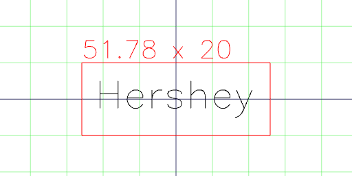
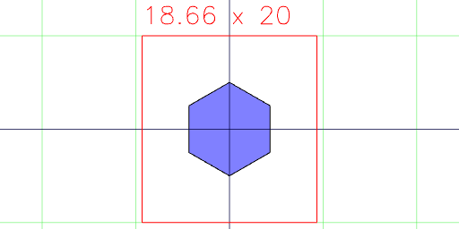

Arc(5).angle(45/360, 270/360)

Assembly(Box(10), Arc(8), Triangle(5))

Box(5, 7, 8)

ChainedHull(Point(), Box(5).z(5), Arc(3).z(8))

Cone(6, 3)

Empty()

Group(Box(10), Arc(8), Triangle(5))

Hershey(10)('Hershey').align('xy')

Hexagon(10)

Hull(Arc(5), Box(5).z(5))

Icosahedron(5)

Line(5, -1)

Octagon(5)

Orb(5)

Path(Point(0), Point(5), Point(5, 5), Point(0)).rz(45 / 2)