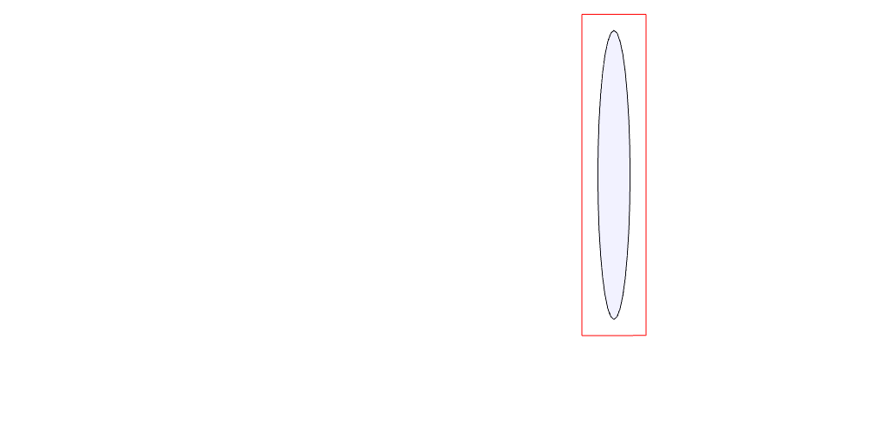

# Arc

---

`Arc.ofRadius(radius, angle = 360, { start = 0, sides = 32 })`

> Draws an clockwise turning arc containing the number of angles, at the given
> radius.

`Arc(radius, angle = 360, { start = 0, sides = 32 })`

As for `Arc.ofRadius`

`Arc(10, 90).topView();`
