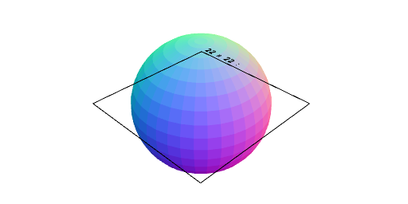
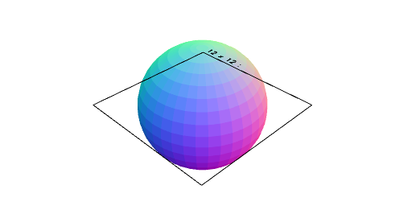
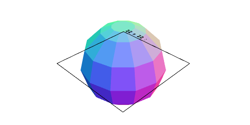

# Sphere

---

'''
Sphere(10).view();
Sphere.ofRadius(10).view();
'''
---

'''
Sphere.ofDiameter(10).view();
'''
---

'''
Sphere.ofApothem(10).view();
'''
---

'''
Sphere(10, { resolution: 4 }).view();
'''
---
