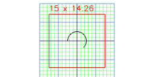
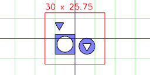
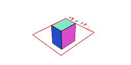
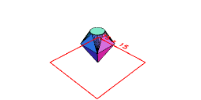
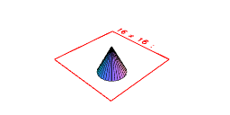
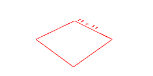

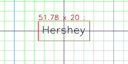
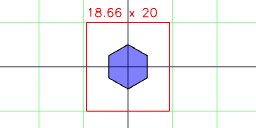
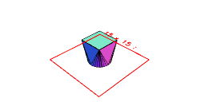
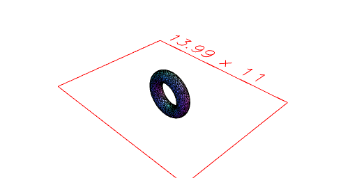
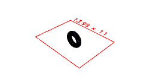
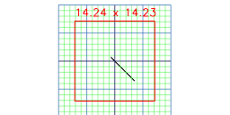
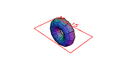
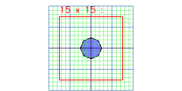
Arc(5).angle(45/360, 270/360)
Assembly(Box(10), Arc(8), Triangle(5))
Box(5, 7, 8)
ChainedHull(Point(), Box(5).z(5), Arc(3).z(8))
Cone(6, 3)
Empty()
Group(Box(10), Arc(8), Triangle(5))
Hershey(10)('Hershey').align('xy')
Hexagon(10)
Hull(Arc(5), Box(5).z(5))
Icosahedron(5)
Implicit(torusFn, { radius: 2 }
Line(5, -1)
Octagon(5)
Orb(5)
Path(Point(0), Point(5), Point(5, 5), Point(0)).rz(45 / 2)