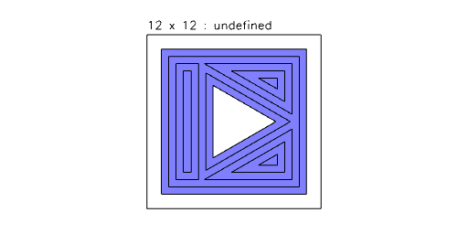

# Shape.shrink examples.

[Open in Editor](https://jsxcad.js.org/preAlphaHead/#JSxCAD@https://gitcdn.link/cdn/jsxcad/JSxCAD/master/api/v1-shell/shrink/shrink.nb)

---

Shape.shrink reduces a shape by moving its faces backward along their normals by some amount.

---

