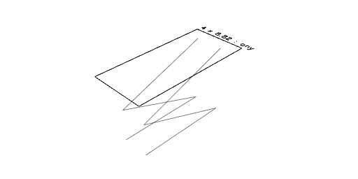
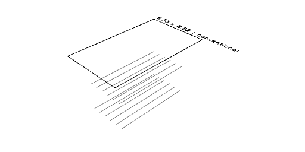
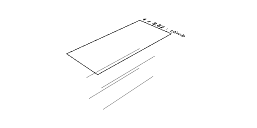

# BenchSaw examples.

[Open in Editor](https://jsxcad.js.org/preAlphaHead/#JSxCAD@https://gitcdn.link/cdn/jsxcad/JSxCAD/master/algorithm/toolpath/BenchSaw/BenchSaw.nb)

---

Default milling style zig-zags down then planes the base.

Conventional milling drills down, then moves horizontally.

Climb milling drills down, then moves horizontally the other way.
