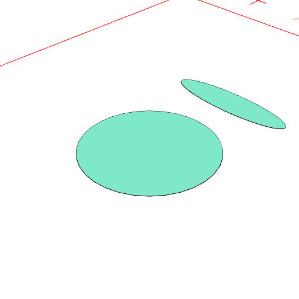
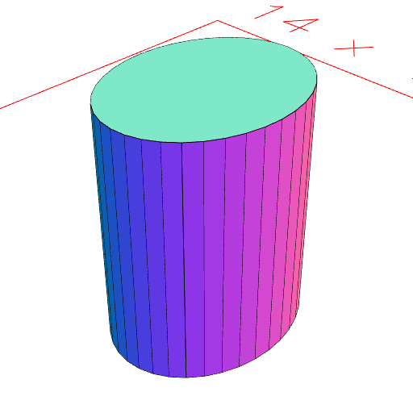
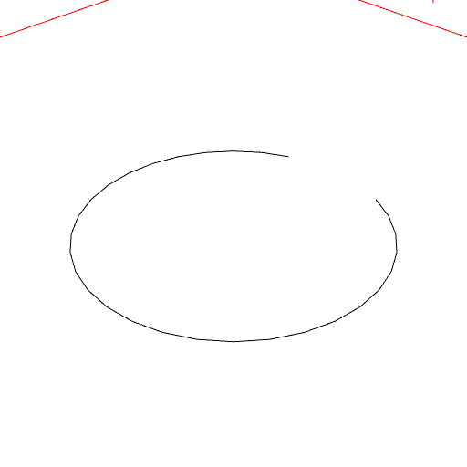
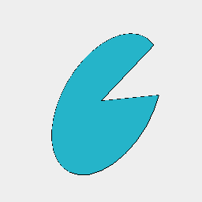

# Arc(...dimensions)

Produces an arc z axis within the dimensions provided.

See: [ArcZ](#https://raw.githubusercontent.com/jsxcad/JSxCAD/master/nb/api/ArcZ.nb)

```JavaScript
Group(Arc(4), Arc(4, [3, 4]))
  .view()
  .md('Dimensions may be ranges.');
```



Dimensions may be ranges.

```JavaScript
Arc(4, 5, 6).view().md('Three dimensions are supported.');
```



Three dimensions are supported.

```JavaScript
Arc(4)
  .hasAngle(1 / 16, 15 / 16)
  .view()
  .md('Angle constraints can be supplied to produce open arcs.');
```



Angle constraints can be supplied to produce open arcs.

```JavaScript
Arc(4)
  .hasAngle(1 / 16, 15 / 16)
  .and(Point())
  .loop()
  .fill()
  .view()
  .md('Points are ordered to allow loops.');
```



Points are ordered to allow loops.
