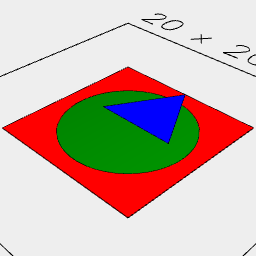
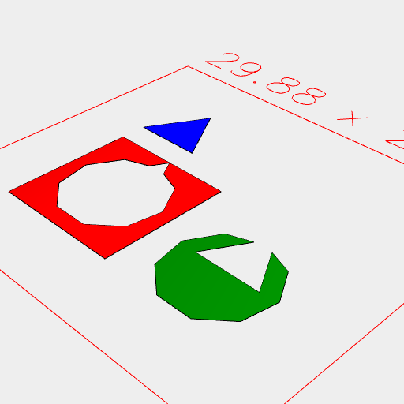

[index](../../nb/api/index.md)
### Assembly()
Parameter|Default|Type
---|---|---
...shapes||The shapes to assemble.

Produces a disjoint assembly of shapes.



Assembly(Box(10), Arc(8), Triangle(6)) assembles three shapes. The triangle cuts the arc and the box. The arc cuts the box.



pack() disassembles the arrangement, showing the disjunction.

```JavaScript
Assembly(
  Box(10).color('red'),
  Arc(8).color('green'),
  Triangle(6).y(2).color('blue')
)
  .view(1)
  .note(
    'Assembly(Box(10), Arc(8), Triangle(6)) assembles three shapes. The triangle cuts the arc and the box. The arc cuts the box.'
  )
  .pack()
  .view(2)
  .note('pack() disassembles the arrangement, showing the disjunction.');
```
