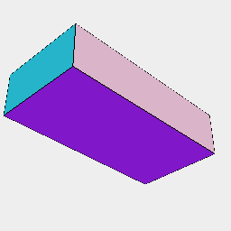

### Cached()
Parameter|Default|Type
---|---|---
name||Unique string qualifying the cached shapes.
constructor||Function to perform the construction.

Checks for a cached construction. If not present it computes and saves it for reuse.

```JavaScript
Cached('box', Box)(1, 2, 4).view().note("Cached('box', Box)(1, 2, 4)");
```



Cached('box', Box)(1, 2, 4)
