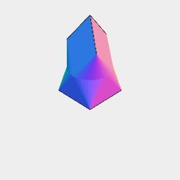

[index](../../nb/api/index.md)
### ChainHull()
Parameter|Default|Type
---|---|---
...shapes||The shapes to hull together in sequence.


Composes the convex hull of each pair of shapes in sequence.



ChainHull(Box(5), Arc(5).z(3), Triangle(5).z(6), Point().z(9)) produces this shape.

```JavaScript
ChainHull(Box(5), Arc(5).z(3), Triangle(5).z(6), Point().z(9))
  .view()
  .note(
    'ChainHull(Box(5), Arc(5).z(3), Triangle(5).z(6), Point().z(9)) produces this shape.'
  );
```
