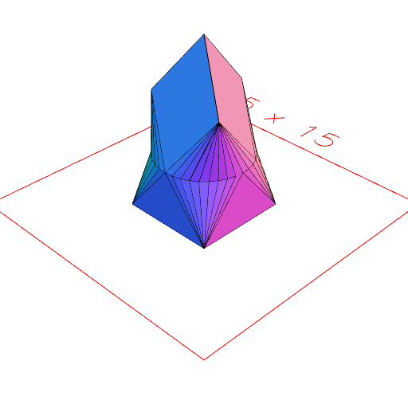

# ChainHull(...shapes)

Composes the convex hull of each pair of shapes in sequence.

```JavaScript
ChainHull(Box(5), Arc(5).z(3), Triangle(5).z(6), Point().z(9))
  .view()
  .md('ChainHull(Box(5), Arc(5).z(3), Triangle(5).z(6), Point().z(9))');
```



ChainHull(Box(5), Arc(5).z(3), Triangle(5).z(6), Point().z(9))
