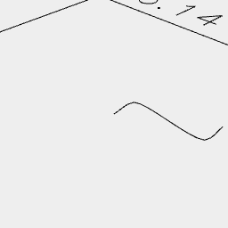
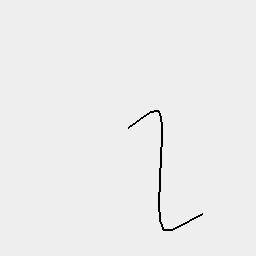

[index](../../nb/api/index.md)
### Curve()
Parameter|Default|Type
---|---|---
start||Coordinate of the start.
c1||Coordinate of the first control point.
c2||Coordinate of the second control point.
end||Coordinate of the third control point.

Produces a curve from start to end with two control points.

Zag limits can be specified.

_Todo: Check zag correctness._



Curve([0, 0], [0, 1], [3, 1], [3, 2])



hasZag(0.1) increases the resolution.

```JavaScript
Curve([0, 0], [0, 1], [3, 1], [3, 2], { zag: 0.1 })
  .view(1)
  .note('Curve([0, 0], [0, 1], [3, 1], [3, 2])')
  .view(2)
  .note('hasZag(0.1) increases the resolution.');
```
