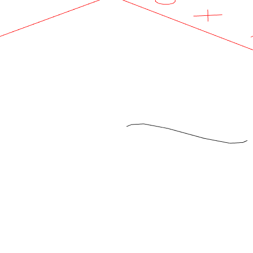
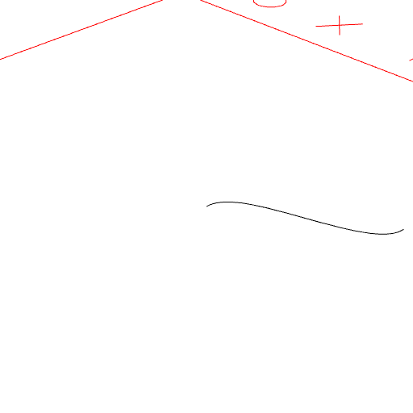

# Curve(start, c1, c2, end)

Produces a curve from start to end with two control points.

Zag limits can be specified.

_Todo: Check zag correctness._

```JavaScript
Curve([0, 0], [0, 1], [3, 1], [3, 2])
  .view(1)
  .md('Curve([0, 0], [0, 1], [3, 1], [3, 2])');
```



Curve([0, 0], [0, 1], [3, 1], [3, 2])

```JavaScript
Curve(Point(0, 0), [0, 1], [3, 1], Point(3, 2))
  .hasZag(0.1)
  .view(4)
  .md('Curve(Point(0, 0), [0, 1], [3, 1], Point(3, 2)).hasZag(0.1)');
```



Curve(Point(0, 0), [0, 1], [3, 1], Point(3, 2)).hasZag(0.1)
