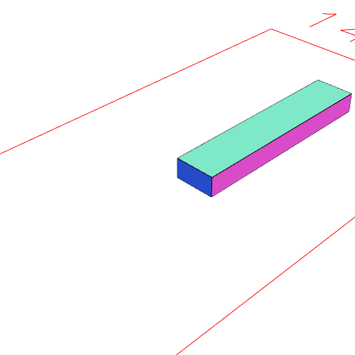
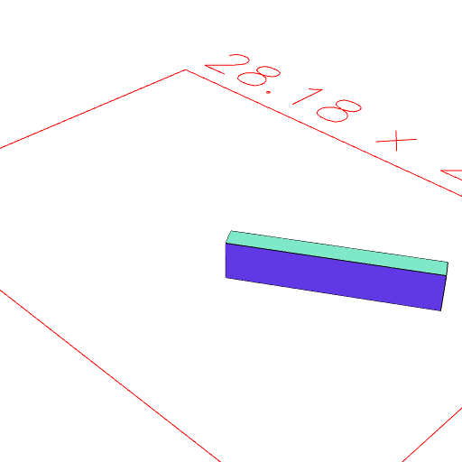

# Edge
'''
Edge(source = [0, 0, 0], target = [0, 0, 1], normal = [1, 0, 0]);
'''

This produces an oriented segment from source coordinate to target coordinate.

The segment has a consistent local orientation along z, facing x.

## See also
[eachEdge](#https://raw.githubusercontent.com/jsxcad/JSxCAD/master/nb/api/eachEdge.nb)

## Examples

Edges can be used to orient other geometry.

```JavaScript
Box([0, 1], [0, 2], [0, 10])
  .to(Edge(Point(), Point(0, 6), Point(0, 0, 5)))
  .view();
```



```JavaScript
Box([0, 1], [0, 2], [0, 10])
  .to(Edge(Point(), [5, 3]))
  .view();
```



Edges can also be used to build faces.

```JavaScript
Group(
  Edge([0, 0], [0, 1]),
  Edge([0, 1], [1, 1]),
  Edge([1, 1], [1, 0]),
  Edge([1, 0], [0, 0])
)
  .fill()
  .topView();
```


