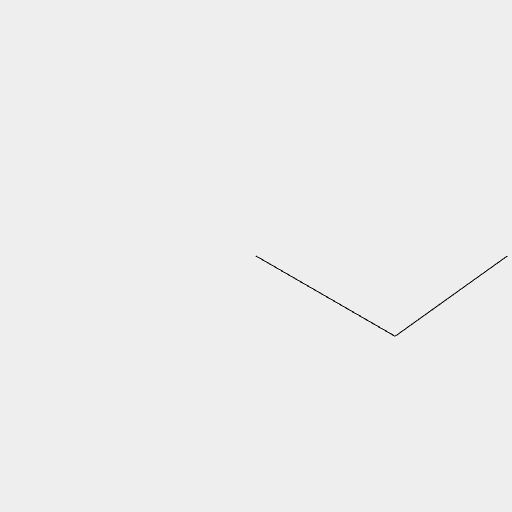

[index](../../nb/api/index.md)
### Edges()
Parameter|Default|Type
---|---|---
|edges|[]|List of lists of coordinates to construct

Constructs a set of segments given the supplied coordinates.



Edges([[[0, 0, 0], Point(1, 0, 0)], [Point(1, 0, 0), [1, 1, 0]]]) converts coordinates.

```JavaScript
Edges([
  [[0, 0, 0], Point(1, 0, 0)],
  [Point(1, 0, 0), [1, 1, 0]],
])
  .view()
  .note(
    'Edges([[[0, 0, 0], Point(1, 0, 0)], [Point(1, 0, 0), [1, 1, 0]]]) converts coordinates.'
  );
```
