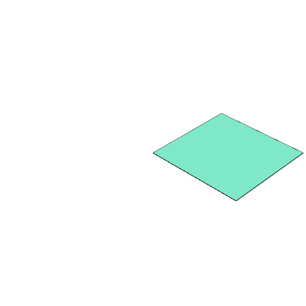
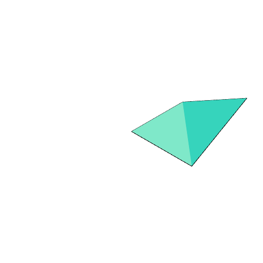
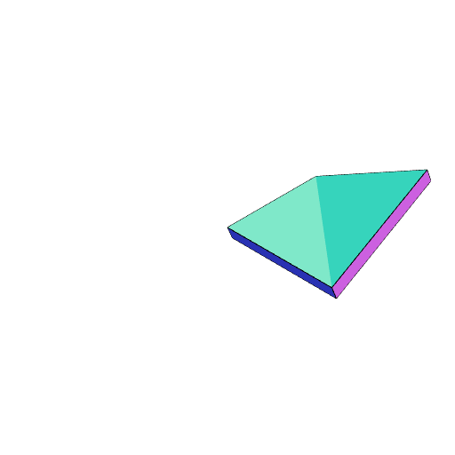

### Face()
Parameter|Default|Type
---|---|---
|...coordinates||List coordinates to turn into a face.

```JavaScript
Face([0, 0, 0], [1, 0, 0], [1, 1, 0], [0, 1, 0])
  .view()
  .note('Face([0, 0, 0], [1, 0, 0], [1, 1, 0], [0, 1, 0])');
```



Face([0, 0, 0], [1, 0, 0], [1, 1, 0], [0, 1, 0])

```JavaScript
Face([0, 0, 0], [1, 0, 0], [1, 1, 0.5], [0, 1, 0])
  .view()
  .note(
    'Face([0, 0, 0], [1, 0, 0], [1, 1, 0], [0, 1, 0.5]) will produce a non-flat face of two facets'
  );
```



Face([0, 0, 0], [1, 0, 0], [1, 1, 0], [0, 1, 0.5]) will produce a non-flat face of two facets

```JavaScript
Face([0, 0, 0], [1, 0, 0], [1, 1, 0.5], [0, 1, 0])
  .e(0.1)
  .view()
  .note(
    'Face([0, 0, 0], [1, 0, 0], [1, 1, 0], [0, 1, 0.5]).e(0.1) extrudes a non-flat face along the overall face normal'
  );
```



Face([0, 0, 0], [1, 0, 0], [1, 1, 0], [0, 1, 0.5]).e(0.1) extrudes a non-flat face along the overall face normal
