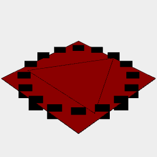

[index](../../nb/api/index.md)
### Group()
Parameter|Default|Type
---|---|---
|...shapes||The shapes to group.

Collects the shapes in a group.

A group is an ordered list of shapes, that do not otherwise interact.

Elements of the group can be accessed via [n](../../nb/api/n.md)

See: [n](../../nb/api/n.md)



Group(Box().color('red'), Triangle().outline(), Arc().points()).view() produces a group of different types of geometry.

```JavaScript
Group(Box().color('red'), Triangle().outline(), Arc().points())
  .view()
  .note(
    "Group(Box().color('red'), Triangle().outline(), Arc().points()).view() produces a group of different types of geometry."
  );
```
