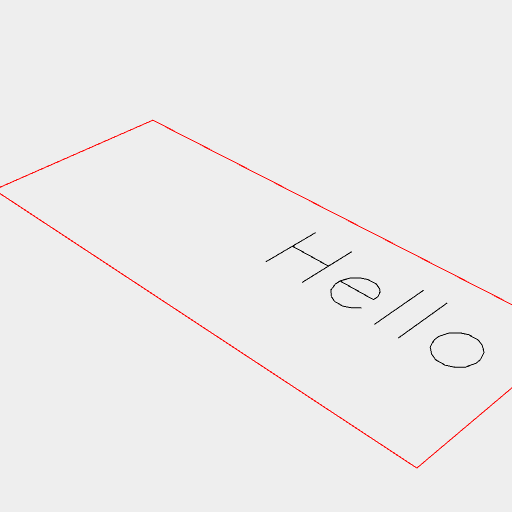

[index](../../nb/api/index.md)
### Hershey()
Parameter|Default|Type
text||String containing the text to render.
size||1|Number giving the scale of the text.

This is a very simple font that can render ascii as line segments.



Hershey('Hello', 12)

```JavaScript
Hershey('Hello', 12).view().note("Hershey('Hello', 12)");
```
