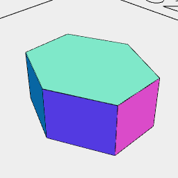

[index](../../nb/api/index.md)
### Hexagon()
Parameter|Default|Type
...dimensions||Size of the bounding box to contain the hexagon.

This produces a hexagon that would be inscribed within an arc inscribed within a bounding box of the given size.

See: [Arc](../../nb/api/Arc.md).

_FIX: The whole Arc should be red._

```JavaScript
Box(10)
  .color('black')
  .fitTo(Arc(10).color('red'), Hexagon(10).color('blue'))
  .view()
  .note(
    "Box(10).color('black').fitTo(Arc(10).color('red'), Hexagon(10).color('blue')) shows the hexagon inscribed within the arc inscribed within the box."
  );
```



Hexagon(5, 4, 2) produces a prism to fill a three dimensional bounding box.

```JavaScript
Hexagon(5, 4, 2)
  .view()
  .note(
    'Hexagon(5, 4, 2) produces a prism to fill a three dimensional bounding box.'
  );
```
