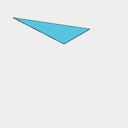
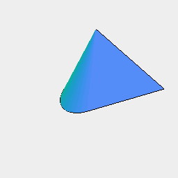

[index](../../nb/api/index.md)
### Hull()
Parameter|Default|Type
---|---|---
|...shapes||Shapes from which to build a convex hull.

Constructs a convex hull to cover the shapes.



Hull(Point(1, 2, 3), Line([5, -2])) produces a single face.

```JavaScript
Hull(Point(1, 2, 3), Line([5, -2]))
  .view()
  .note('Hull(Point(1, 2, 3), Line([5, -2])) produces a single face.');
```



Hull(Point(1, 2, 3), Line([5, -2]), Arc(4)) produces a solid.

```JavaScript
Hull(Point(1, 2, 3), Line([5, -2]), Arc(4))
  .view()
  .note('Hull(Point(1, 2, 3), Line([5, -2]), Arc(4)) produces a solid.');
```
