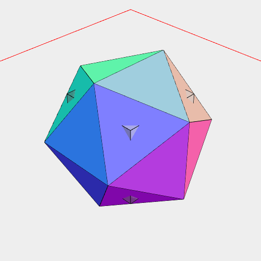
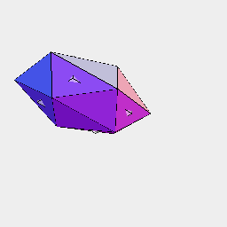

[index](../../nb/api/index.md)
# Icosahedron(...dimensions)

Produces an icosahedron that fits the bounding dimensions.

```JavaScript
Icosahedron(3).and(Box(3, 3, 3).material('glass')).view().md('Icosahedron(3)');
```



Icosahedron(3)

```JavaScript
Icosahedron(1, 2, [0, 3])
  .and(Box(1, 2, [0, 3]).material('glass'))
  .view()
  .md('Icosahedron(1, 2, [0, 3])');
```



Icosahedron(1, 2, [0, 3])
