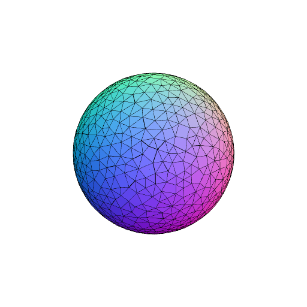

### Implicit()
Parameter|Default|Type
---|---|---
function||Function to determine the volume.
radius|1|Radius of a sphere that the result will fit into.
{angularBound}|30|
{distanceBound}|0.1|
{errorBound}|0.001|

Builds a volume by finding the surface at which function(x, y, z) is approximately zero.

_Note: non-deterministic._

```JavaScript
Implicit((x, y, z) => x * x + y * y + z * z - 1, 2)
  .view({ withGrid: false })
  .md(
    'Implicit((x, y, z) => x * x + y * y + z * z - 1, 2) produces a sphere of radius 1.'
  );
```



Implicit((x, y, z) => x * x + y * y + z * z - 1, 2) produces a sphere of radius 1.
