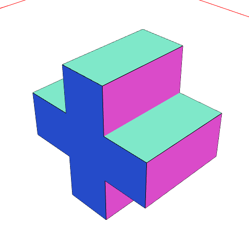

### Join()
Parameter|Default|Type
---|---|---
...shapes||The shapes to join
'exact'|false|Use exact, but slower, geometry

Join takes an empty geometry and extends it to cover the space of shapes.

See: [join](../../nb/api/join.md)

```JavaScript
Join(Box(1, 2, 3), Box(3, 2, 1))
  .view()
  .note('Join(Box(1, 2, 3), Box(3, 2, 1))');
```



Join(Box(1, 2, 3), Box(3, 2, 1))

```JavaScript
Join(Box(1, 2), Box(2, 1)).view().note('Join(Box(1, 2), Box(2, 1))');
```


Join(Box(1, 2), Box(2, 1))
