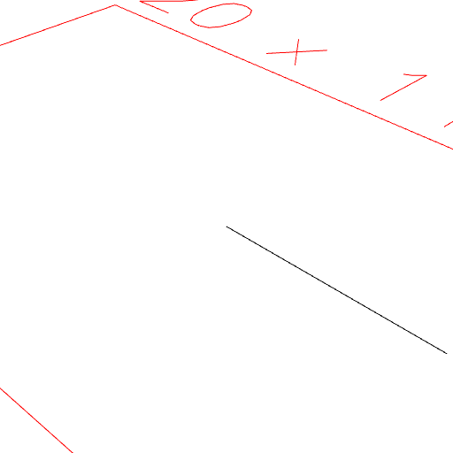
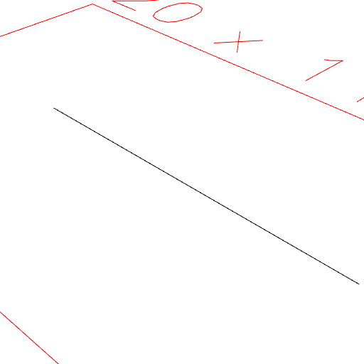
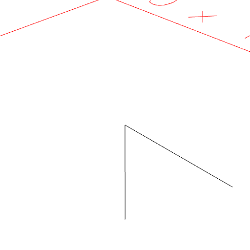
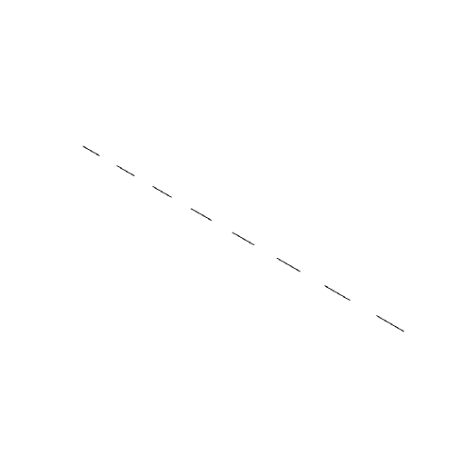

### Line()
Parameter|Default|Type
---|---|---
|...extents||Number of mm at which to start and stop segments.

Constructs a segmented line along the x axis.

An odd number of extents will have a zero appended.

The extents are then sorted and paired.

_Note: Appending a zero into a sequence with negative numbers can have surprising results._

```JavaScript
Line(5).view().note('Line(5) produces a line from [0, 0, 0] to [5, 0, 0].');
```



Line(5) produces a line from [0, 0, 0] to [5, 0, 0].

```JavaScript
Line(5, -5)
  .view()
  .note('Line(5, -5) produces a line from [-5, 0, 0] to [5, 0, 0].');
```



Line(5, -5) produces a line from [-5, 0, 0] to [5, 0, 0].

```JavaScript
Line(5)
  .and(rz(1 / 8))
  .view()
  .note('Line(5).and(rz(1 / 8)) produces a 1/8th angle.');
```



Line(5).and(rz(1 / 8)) produces a 1/8th angle.

```JavaScript
Line(seq({ from: -1, upto: 1, by: 1 / 8 }, noOp(), List))
  .view()
  .note(
    'Line(seq({ from: -1, upto: 1, by: 1 / 8 }, noOp(), List)) produces a dashed line.'
  );
```



Line(seq({ from: -1, upto: 1, by: 1 / 8 }, noOp(), List)) produces a dashed line.
