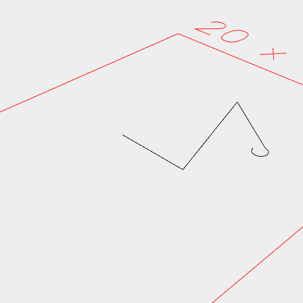
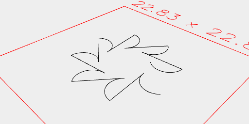

[index](../../nb/api/index.md)
### Link()
Parameter|Default|Type
---|---|---
|...shapes||Shapes to link into a polyline.

Constructs a polyline from the segments of shapes.

The shapes are linked by straight segments.

The polyline is not closed.

See: [Loop](../../nb/api/Loop.md)

_Note: We should rethink Arc and Box being implicitly filled._



```JavaScript
Link(
  Line(5),
  Point(0, 8),
  Arc([4, 5], [4, 5], { start: 0 / 4, end: 3 / 4 })
    .outline()
).view();
```



```JavaScript
Seq(
  { by: 1 / 8, upto: 1 },
  (t) =>
    Arc(4, { start: 3 / 8, end: 6 /8 })
      .x(5)
      .rz(t),
  Link
).view();
```
