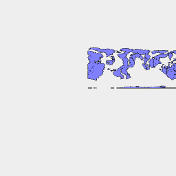

[index](../../nb/api/index.md)
### LoadPng()
Parameter|Default|Type
---|---|---
path||The path or url to load
bands|[128, 256]|The threshold bands to draw contours at.

```JavaScript
await LoadPng('https://jsxcad.js.org/png/bathymetry.png').view().note(`await LoadPng('https://jsxcad.js.org/png/bathymetry.png')`);
```



await LoadPng('https://jsxcad.js.org/png/bathymetry.png')
