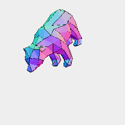

[index](../../nb/api/index.md)
### LoadStl()
Parameter|Default|Type
---|---|---
path||The path or url to load
'binary'||Read from a binary representation.

```JavaScript
await LoadStl('https://jsxcad.js.org/stl/bear.stl').view().note(`await LoadStl('https://jsxcad.js.org/stl/bear.stl')`);
```



await LoadStl('https://jsxcad.js.org/stl/bear.stl')
