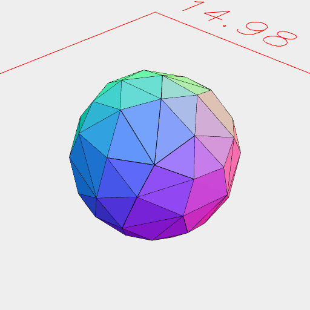
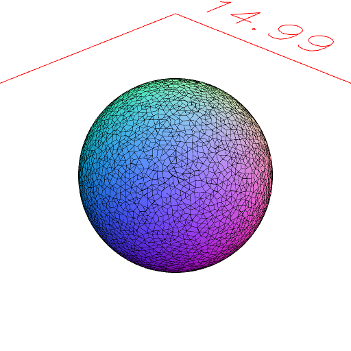

### Orb()
Parameter|Default|Type
---|---|---
...dimensions|[1, 1, 1]|The size of the bounding box of the orb.

Produces an orb that fits into the bounding box.

The error of the orb is limited by hasZag(mm), defaulting to 1.

Dimensions may be ranges as usual. e.g., Orb(1, 2, [4, 5]).

See: [hasZag](../../nb/api/hasZag.md)

```JavaScript
Orb(5).and(Box(5, 5, 5).material('glass')).view().md('Orb(5)');
```


Orb(5)

```JavaScript
Orb(3, 4, [0, 5])
  .and(Box(3, 4, [0, 5]).material('glass'))
  .view()
  .md('Orb(3, 4, [0, 5])');
```


Orb(3, 4, [0, 5])

```JavaScript
Orb(5)
  .view(1)
  .md('Orb(5) is rough with an tolerance of 1 mm')
  .hasZag(0.1)
  .view(2)
  .md('Orb(5).hasZag(0.1) is much smoother with a tolerance of 0.1 mm');
```



Orb(5) is rough with an tolerance of 1 mm



Orb(5).hasZag(0.1) is much smoother with a tolerance of 0.1 mm
