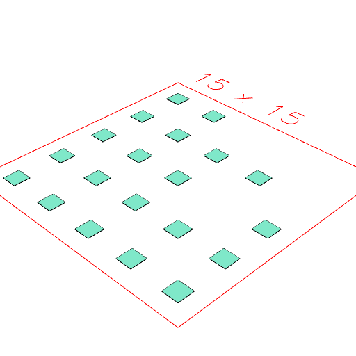

### Page()
Parameter|Default|Type
---|---|---
{size}||Pair of numbers [width, height]
{pageMargin}|5|Number of mm to reserve around the edge of the page
{itemMargin}|1|Number of mm to reserve around each item on the page
{itemsPerPage}|Infinity|Maximum number of shapes per page
'pack'|false|Automatically layout the items on the page.
...shapes||Shapes to place on the page

Builds a page for display or output.

See: [pack](../../nb/api/pack.nb), [page](#https://raw.githubusercontent.com/jsxcad/JSxCAD/master/nb/api/page.md).

_Note: The implementation of Page needs cleaning up._

```JavaScript
Page(
  'pack',
  Seq({ upto: 20 }, () => Box(), Group)
)
  .view()
  .note(
    "Page('pack', Seq({ upto: 20 }, () => Box(), Group)) packs 20 boxes onto a page."
  );
```



Page('pack', Seq({ upto: 20 }, () => Box(), Group)) packs 20 boxes onto a page.
