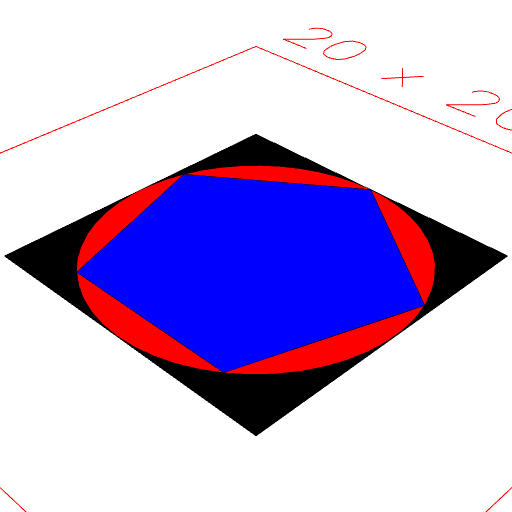
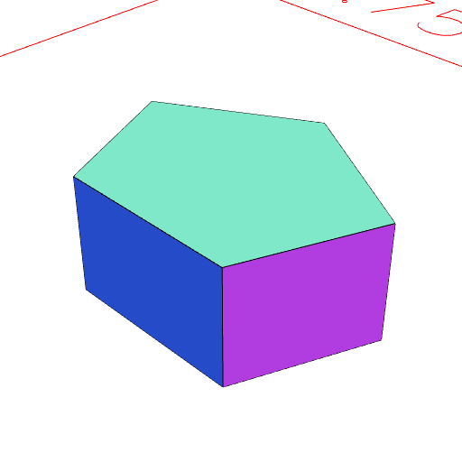

### Pentagon()
Parameter|Default|Type
...dimensions||Size of the bounding box to contain the hexagon.

This produces a pentagon that would be inscribed within an arc inscribed within a bounding box of the given size.

See: [Arc](../../nb/api/Arc.md).

```JavaScript
Box(10)
  .color('black')
  .fitTo(Arc(10).color('red'), Pentagon(10).color('blue'))
  .view()
  .note(
    "Box(10).color('black').fitTo(Arc(10).color('red'), Pentagon(10).color('blue')) shows the hexagon inscribed within the arc inscribed within the box."
  );
```



Box(10).color('black').fitTo(Arc(10).color('red'), Pentagon(10).color('blue')) shows the hexagon inscribed within the arc inscribed within the box.

```JavaScript
Pentagon(5, 4, 2)
  .view()
  .note(
    'Pentagon(5, 4, 2) produces a prism to fill a three dimensional bounding box.'
  );
```



Pentagon(5, 4, 2) produces a prism to fill a three dimensional bounding box.
