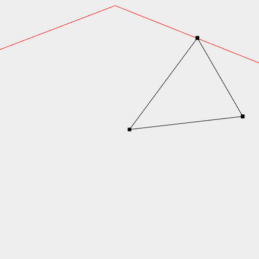

[index](../../nb/api/index.md)
### Points()
Parameter|Default|Type
---|---|---
...coordinates|[0, 0, 0]|Coordinates of the points.

Constructs a point at the coordinate.



Points([[1, 2, 3], [3, 2, 1], [0, 0, 0]]).and(loop()) shows three points linked together.

```JavaScript
Points([
  [1, 2, 3],
  [3, 2, 1],
  [0, 0, 0],
])
  .and(loop())
  .view()
  .note(
    'Points([[1, 2, 3], [3, 2, 1], [0, 0, 0]]).and(loop()) shows three points linked together.'
  );
```
