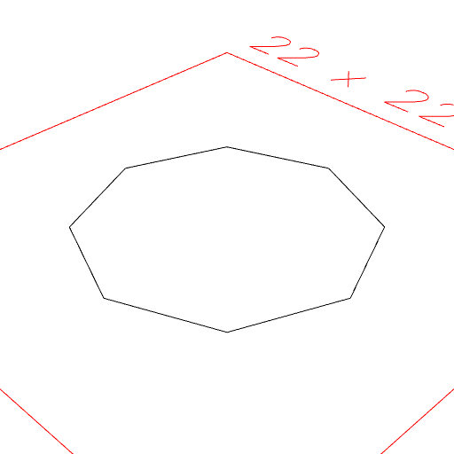

### Polygon()
Parameter|Default|Type
---|---|---
...coordinates|[]|Coordinates of the vertices.

Constructs a polygon from a sequence of points.

```JavaScript
Polygon(Point(6).rz(seq({ by: 1 / 8, upto: 1 })))
  .view()
  .note(
    'Polygon(Point(10).rz(seq({ by: 1 / 8, upto: 1 }))) produces a regular octagon.'
  );
```



Polygon(Point(10).rz(seq({ by: 1 / 8, upto: 1 }))) produces a regular octagon.
