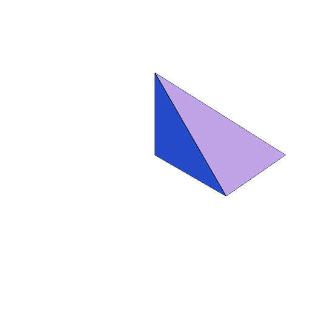

### Polyhedron()
Parameter|Default|Type
---|---|---
paths|[]|A list of loop of points.

Constructs a potentially open surface.

We use loops of points rather than indexed paths since converting indexed paths to loops of points is straight-forward, but the inverse requires deduplication.

```JavaScript
Polyhedron(
  [
    [0, 0, 0],
    [1, 1, 0],
    [1, 0, 0],
  ],
  [
    [0, 0, 1],
    [1, 0, 0],
    [1, 1, 0],
  ],
  [
    [0, 0, 1],
    [1, 1, 0],
    [0, 0, 0],
  ],
  [
    [0, 0, 0],
    [0, 0, 1],
    [1, 0, 0],
  ]
)
  .view(1, 'wireframe')
  .note(
    'Polyhedron([[0, 0, 0], [1, 1, 0], [1, 0, 0]], [[0, 0, 1], [1, 0, 0], [1, 1, 0]], [[0, 0, 1], [1, 1, 0], [0, 0, 0]], [[0, 0, 0], [0, 0, 1], [1, 0, 0]]) produces this shape.'
  );
```


Polyhedron([[0, 0, 0], [1, 1, 0], [1, 0, 0]], [[0, 0, 1], [1, 0, 0], [1, 1, 0]], [[0, 0, 1], [1, 1, 0], [0, 0, 0]], [[0, 0, 0], [0, 0, 1], [1, 0, 0]]) produces this shape.

```JavaScript
Polyhedron(
  Polygon(Point(0, 0, 0), Point(1, 1, 0), Point(1, 0, 0)),
  Polygon([0, 0, 1], [1, 0, 0], [1, 1, 0]),
  [
    [0, 0, 1],
    [1, 1, 0],
    [0, 0, 0],
  ],
  [
    [0, 0, 0],
    [0, 0, 1],
    [1, 0, 0],
  ]
)
  .view('wireframe')
  .note(
    'Polyhedron(Polygon(Point(0, 0, 0), Point(1, 1, 0), Point(1, 0, 0)), Polygon([0, 0, 1], [1, 0, 0], [1, 1, 0]), [[0, 0, 1], [1, 1, 0], [0, 0, 0]], [[0, 0, 0], [0, 0, 1], [1, 0, 0]]) also produces that shape.'
  );
```



Polyhedron(Polygon(Point(0, 0, 0), Point(1, 1, 0), Point(1, 0, 0)), Polygon([0, 0, 1], [1, 0, 0], [1, 1, 0]), [[0, 0, 1], [1, 1, 0], [0, 0, 0]], [[0, 0, 0], [0, 0, 1], [1, 0, 0]]) also produces that shape.
