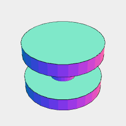
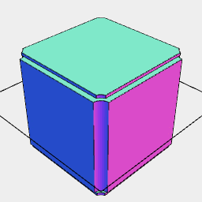

[index](../../nb/api/index.md)
### Route()
Parameter|Default|Type
---|---|---
tool||The tool shape to route.
...segments||The segments to route alone.

Follows the provided segment paths with the vertically oriented tool shape.



tool = Arc(3).Loft(z(-1), z(-0.5), inset(1).z(-0.5), inset(1).z(0.5), z(0.5), z(1))

```JavaScript
const tool = Arc(3)
  .Loft(z(-1), z(-0.5), inset(1).z(-0.5), inset(1).z(0.5), z(0.5), z(1))
  .view()
  .note('tool = Arc(3).Loft(z(-1), z(-0.5), inset(1).z(-0.5), inset(1).z(0.5), z(0.5), z(1))');
```



path = Box(20, 20, 20).cut(Route(tool, outline()))

```JavaScript
const path = Box(20, 20, 20)
  .cut(Route(tool, outline()))
  .view(clean())
  .note('path = Box(20, 20, 20).cut(Route(tool, outline()))');
```
