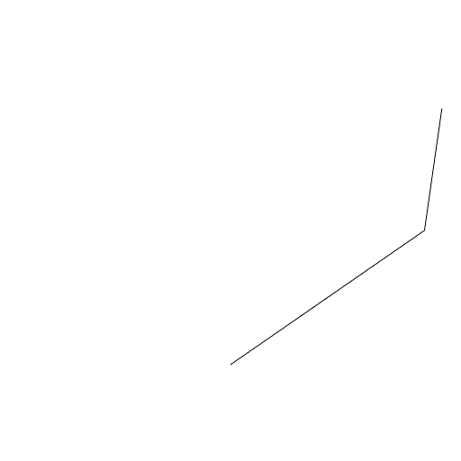

### Segments()
Parameter|Default|Type
---|---|---
segments|[]|Set of [source, target] segments.

These segments do not have individual orientation.

See: [Edge](../../nb/api/Edge.md).

```JavaScript
Segments([
  [
    [1, 1],
    [1, -1],
  ],
  [
    [1, 1, 0],
    [1, 1, 1],
  ],
])
  .view()
  .note('Segments([[[1, 1], [1, -1]], [[1, 1, 0], [1, 1, 1]]])');
```



Segments([[[1, 1], [1, -1]], [[1, 1, 0], [1, 1, 1]]])
