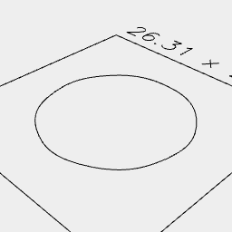

[index](../../nb/api/index.md)
### Skeleton()
Parameter|Default|Type
---|---|---
geometries||The volumes to skeletalize.

Generates a set of skeletal segments from the provided volumes.

Note that skeletonization is sensitive to mesh density, so it may be necessary to prepare the volumes with remesh().



Skeleton(Arc(20).cut(inset(2)).ez(5))

```JavaScript
Skeleton(Arc(20).cut(inset(2)).ez(5)).view().note(`Skeleton(Arc(20).cut(inset(2)).ez(5))`);
```
