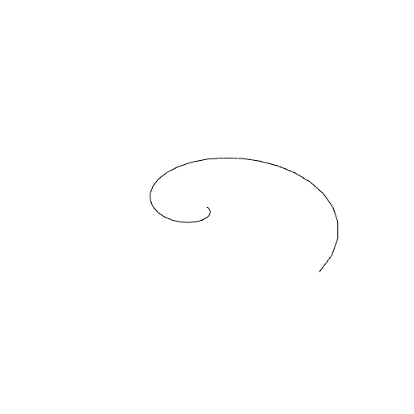
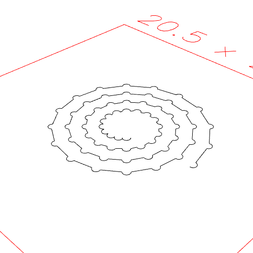
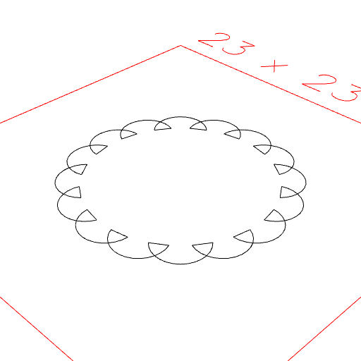

### Spiral()
Parameter|Default|Type
---|---|---
op|Point|Function or shape to build from.
{from}|0|Turn to start with.
{by}|1|Turn to increase by.
{to}|1|Turn to stop at, inclusive.
{upto}||Turn to stop at, exclusive.

Links the points produced by _op_ to form a spiral.

```JavaScript
Spiral({ by: 1 / 32 })
  .view()
  .note('Spiral({ by: 1 / 32 })');
```



Spiral({ by: 1 / 32 })

```JavaScript
Spiral(
  (t) =>
    Arc(0.5)
      .hasAngle(0 / 4, 2 / 4)
      .x(t),
  { from: 1 + 2 / 16, by: 1 / 16, to: 5 }
)
  .view()
  .note(
    'Spiral((t) => Arc(0.5).hasAngle(0 / 4, 2 / 4).x(t), { from: 1 + 2 / 16, by: 1 / 16, to: 5 })'
  );
```



Spiral((t) => Arc(0.5).hasAngle(0 / 4, 2 / 4).x(t), { from: 1 + 2 / 16, by: 1 / 16, to: 5 })

```JavaScript
Spiral(
  (t) =>
    Arc(3)
      .hasAngle(0 / 4, 2 / 4)
      .x(5),
  { by: 1 / 16 }
)
  .view()
  .note('Spiral((t) => Arc(3).hasAngle(0 / 4, 2 / 4).x(5), { by: 1 / 16 })');
```



Spiral((t) => Arc(3).hasAngle(0 / 4, 2 / 4).x(5), { by: 1 / 16 })
