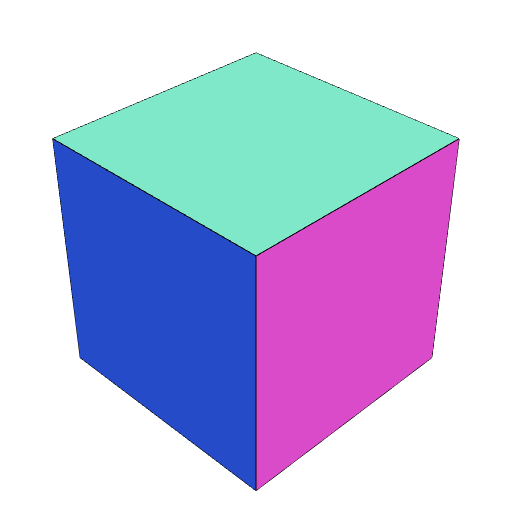

### SurfaceMesh()
Parameter|Default|Type
---|---|---
serialization||A serialized surface mesh.

Reconstructs a surface mesh from its serialization.

_This is intended for debugging._

```JavaScript
SurfaceMesh(
  '8
1/2 -1/2 -1/2 500 -500 -500
1/2 1/2 -1/2 500 500 -500
-1/2 1/2 -1/2 -500 500 -500
-1/2 -1/2 -1/2 -500 -500 -500
1/2 -1/2 1/2 500 -500 500
1/2 1/2 1/2 500 500 500
-1/2 1/2 1/2 -500 500 500
-1/2 -1/2 1/2 -500 -500 500

12
3 2 1 0
3 2 0 3
3 6 4 5
3 6 7 4
3 5 4 1
3 0 1 4
3 6 5 2
3 1 2 5
3 7 6 3
3 2 3 6
3 4 7 0
3 3 0 7
'
).view();
```


