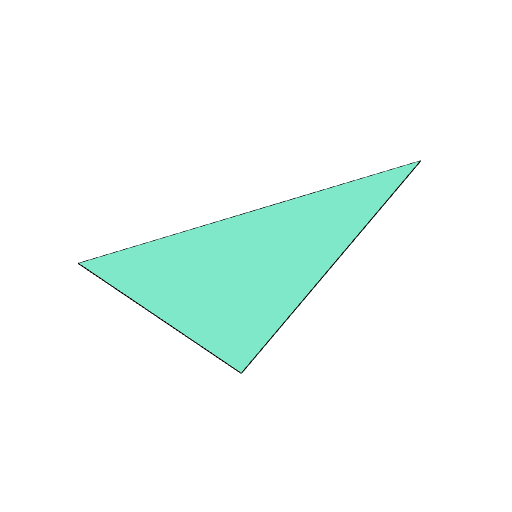
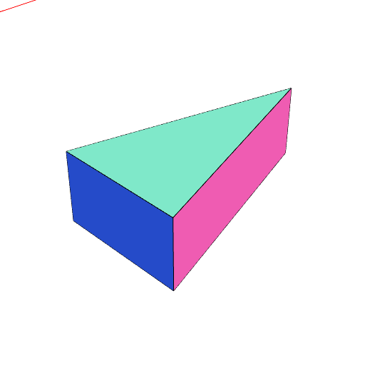

### Triangle()
Parameter|Default|Type
---|---|---
...dimensions|[1, 1, 1]|The size of the bounding box of the triangle.

Produces an triangle or triangular prism that fits into the bounding box.

```JavaScript
Triangle(5).view().note('Triangle(5)');
```


Triangle(5)

```JavaScript
Triangle(2, 4).view().note('Triangle(2, 4)');
```



Triangle(2, 4)

```JavaScript
Triangle(2, 4, 1).view().note('Triangle(2, 4, 1)');
```



Triangle(2, 4, 1)
