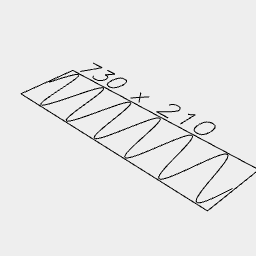

[index](../../nb/api/index.md)
### Wave()
Parameter|Default|Type
---|---|---
op|Point|Function or shape to build from.
{from}|0|Turn to start with.
{by}|1|Turn to increase by.
{to}|1|Turn to stop at, inclusive.
{upto}||Turn to stop at, exclusive.

Links the points produced by _op_ to form a wave.



Wave({ from: -3, to: 3, by: 1 / 32 }, (t) => Point().y(sin(t)))

```JavaScript
Wave({ from: -3, to: 3, by: 1 / 32 }, (t) => Point().y(sin(t)))
  .view('top')
  .note('Wave({ from: -3, to: 3, by: 1 / 32 }, (t) => Point().y(sin(t)))');
```
