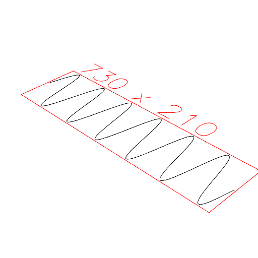

### Wave()
Parameter|Default|Type
---|---|---
op|Point|Function or shape to build from.
{from}|0|Turn to start with.
{by}|1|Turn to increase by.
{to}|1|Turn to stop at, inclusive.
{upto}||Turn to stop at, exclusive.

Links the points produced by _op_ to form a wave.

```JavaScript
Wave({ from: -360, to: 360 }, (t) => Point().y(sin(t * 3) * 100))
  .view()
  .note('Wave({ from: -360, to: 360 }, (t) => Point().y(sin(t * 3) * 100))');
```



Wave({ from: -360, to: 360 }, (t) => Point().y(sin(t * 3) * 100))
