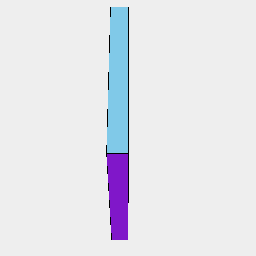
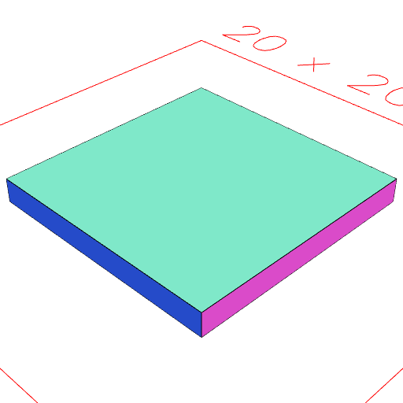
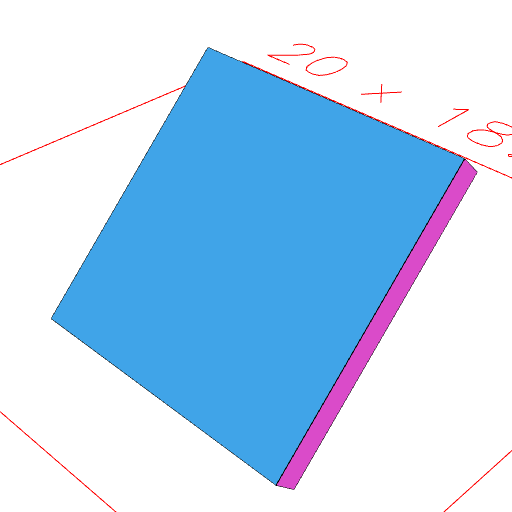

# absolute()

Makes the local orientation of a shape match its absolute orientation.

This means that [flat](../../nb/api/flat.md) will have no effect.

See: [flat](../../nb/api/flat.md).

```JavaScript
Box(10)
  .ez(1)
  .rx(1 / 8)
  .view(1)
  .note('Box(10).ez(1).rx(1 / 8) rotates a box')
  .view(2, flat())
  .note('flat() will restore it to its local orientation.')
  .absolute()
  .view(3)
  .note('absolute() will not affect its global orientation.')
  .flat()
  .view(4)
  .note('But now flat() will restore it to that orientation.');
```



Box(10).ez(1).rx(1 / 8) rotates a box



flat() will restore it to its local orientation.



absolute() will not affect its global orientation.


But now flat() will restore it to that orientation.
