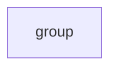

[index](../../nb/api/index.md)
# abstract()

Provides a graph of the shapes internal structure.

_Consider deprecating this operator._

```JavaScript
Box()
  .x(3, 6)
  .seq({ by: 1 / 2 }, rz)
  .abstract()
  .note('Box().x(3, 6).seq({ by: 1 / 2 }, rz).abstract()');
```



Box().x(3, 6).seq({ by: 1 / 2 }, rz).abstract()
