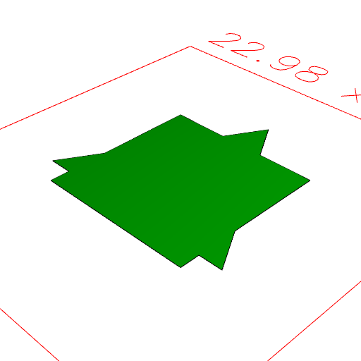
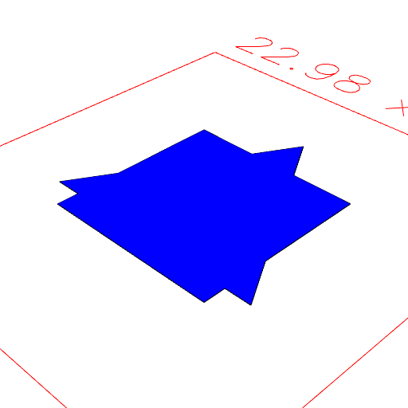

### shape.addTo()
Parameter|Default|Type
---|---|---
other||The shape to be extended.

Extends the form of other to cover the form of shape.

See: [add](../../nb/api/add.md).

```JavaScript
Box(10)
  .color('blue')
  .addTo(Triangle(15).color('green'))
  .view()
  .note(
    "Box(10).color('blue').addTo(Triangle(15).color('green')) produces a green result."
  );
```



Box(10).color('blue').addTo(Triangle(15).color('green')) produces a green result.

```JavaScript
Box(10)
  .color('blue')
  .add(Triangle(15).color('green'))
  .view()
  .note(
    "Box(10).color('blue').add(Triangle(15).color('green')) produces a blue result."
  );
```



Box(10).color('blue').add(Triangle(15).color('green')) produces a blue result.
