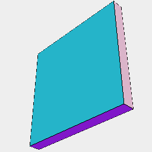
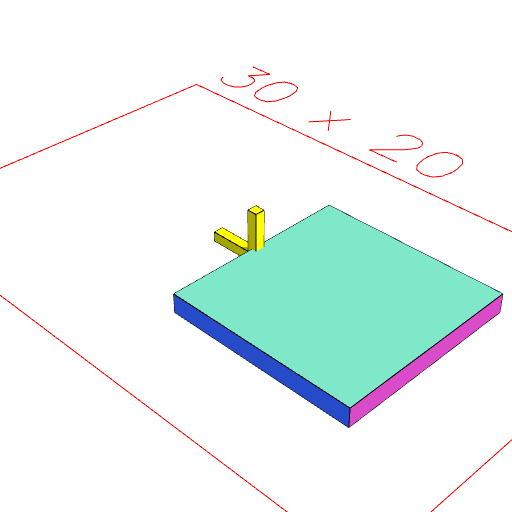
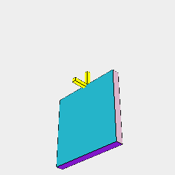
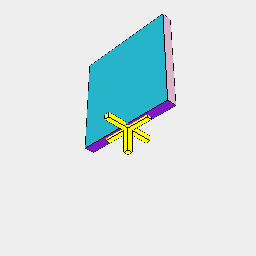
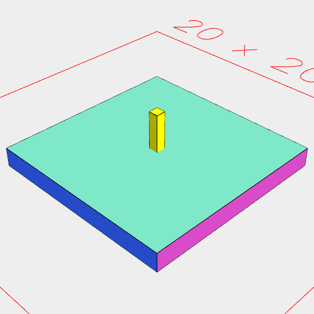
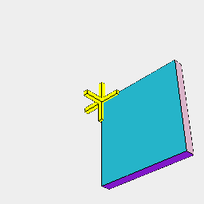

### align()
Parameter|Default|Type
---|---|---
axes|'xyz'|The axis spec.

This produces a reference point such that shape.by(point) will move shape to that alignment position.

Axes can be specified as centered (xyz), above (>x>y>z), or below (<x<y<z), in some combination.

```JavaScript
const origin = Box(0.5, 0.5, 5)
  .and(to(YZ()), to(XZ()))
  .color('yellow')
  .overlay();
```

```JavaScript
Box(10, 10, 1).view().note('Box(10, 10, 1)');
```



Box(10, 10, 1)

```JavaScript
Box(10, 10, 1).by(align()).and(origin).view().md('by(align())');
```



by(align())

```JavaScript
Box(10, 10, 1).by(align('x>')).and(origin).view().md("by(align('x>'))");
```



by(align('x>'))

```JavaScript
Box(10, 10, 1).by(align('x<')).and(origin).view().md("align('x<')");
```



align('x<')

```JavaScript
Box(10, 10, 1).by(align('x')).and(origin).view().md("align('x')");
```



align('x')

```JavaScript
Box(10, 10, 1).by(align('x>y>z<')).and(origin).view().md("align('x>y>z<')");
```



align('x>y>z<')
