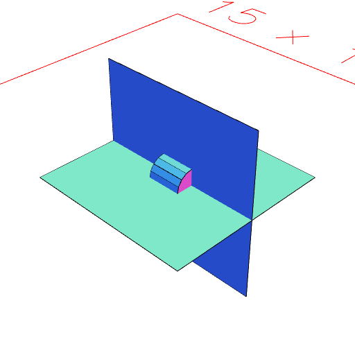

### and()
Parameter|Default|Type
---|---|---
...others||Shapes to group.

Produces a group of the incoming shape and the _others_.

Equivalent to Group(shape, ...shapes).

See: [Group](../../nb/api/Group.md)

```JavaScript
Box(5)
  .and(rx(1 / 4), ArcX(1))
  .view()
  .note('Box(5).and(rx(1 / 4), ArcX(1))');
```



Box(5).and(rx(1 / 4), ArcX(1))
